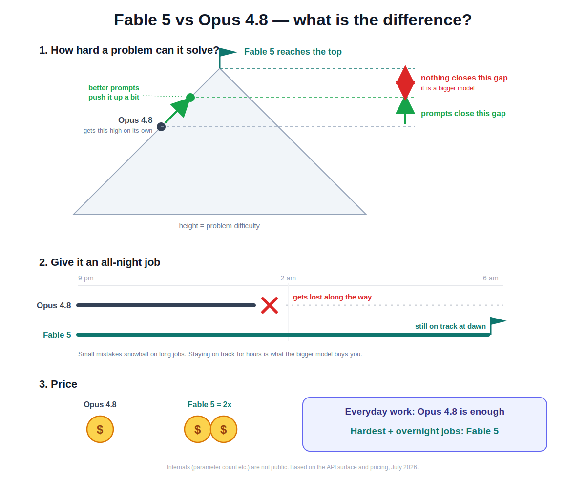

# Fable 5 vs Opus 4.8 — what is the difference?

One picture:

## In three lines

1. **Fable 5 solves harder problems.** Better prompts push Opus 4.8 up a
   bit, but the last stretch never closes — Fable 5 is simply a bigger model.
2. **Fable 5 survives long jobs.** On an all-night autonomous task, Opus 4.8
   tends to drift off track; Fable 5 is still on track at dawn.
3. **Fable 5 costs 2x.** So: everyday work goes to Opus 4.8, only the
   hardest and longest jobs go to Fable 5.

## One paragraph more, if you care

They are different models, not different settings: Fable 5 is a new tier
("Mythos class") above the Opus family, priced at exactly 2x with identical
context and output limits — which means inference genuinely costs more.
Its thinking step is always on (the API refuses to turn it off), and it is
trained specifically for long autonomous runs, where tiny per-step errors
compound exponentially. Parameter counts and architecture are not public;
everything here comes from the official API surface and pricing.

Official announcement:
https://www.anthropic.com/news/claude-fable-5-mythos-5
