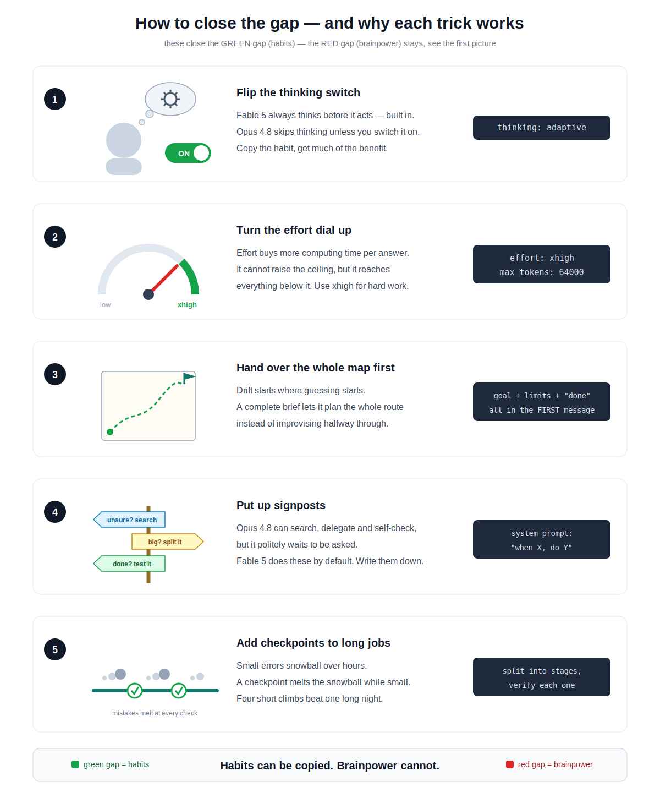

# Fable 5 vs Opus 4.8 — what is the difference?

One picture:


## In three lines

1. **Fable 5 solves harder problems.** Better prompts push Opus 4.8 up a
   bit, but the last stretch never closes — Fable 5 is simply a bigger model.
2. **Fable 5 survives long jobs.** On an all-night autonomous task, Opus 4.8
   tends to drift off track; Fable 5 is still on track at dawn.
3. **Fable 5 costs 2x.** So: everyday work goes to Opus 4.8, only the
   hardest and longest jobs go to Fable 5.

## How to close the gap — and why it works



Five tricks, each copying a habit Fable 5 has by default:

1. `thinking: adaptive` — Fable always thinks before acting; Opus skips it unless switched on.
2. `effort: xhigh` — buys more computing per answer; reaches everything below the ceiling.
3. Whole brief in the first message — drift starts where guessing starts.
4. "When X, do Y" rules — Opus can search / delegate / self-check, but waits to be asked.
5. Checkpoints on long jobs — errors snowball over hours; a check melts them while small.

The banner line is the whole theory: habits can be copied, brainpower cannot.

## Recommended settings

This repo ships [.claude/settings.json](.claude/settings.json) — the setup
that makes Opus 4.8 worth it (quality up, cost still half of Fable 5).
Every value is written out explicitly, including the ones that would
otherwise be silent defaults. **[.claude/README.md](.claude/README.md) maps
each line to the exact API request field it controls** — read that to see
what actually happens on every turn.

Equivalent API call:

```python
client.messages.create(
    model="claude-opus-4-8",
    max_tokens=16000,                      # 64000 at xhigh
    thinking={"type": "adaptive"},
    output_config={"effort": "high"},      # "xhigh" for hard coding/agents
    system=[{"type": "text", "text": FROZEN_PROMPT,
             "cache_control": {"type": "ephemeral"}}],  # ~90% off cached input
    messages=[...],
)
```

## One paragraph more, if you care

They are different models, not different settings: Fable 5 is a new tier
("Mythos class") above the Opus family, priced at exactly 2x with identical
context and output limits — which means inference genuinely costs more.
Its thinking step is always on (the API refuses to turn it off), and it is
trained specifically for long autonomous runs, where tiny per-step errors
compound exponentially. Parameter counts and architecture are not public;
everything here comes from the official API surface and pricing.

Official announcement:
https://www.anthropic.com/news/claude-fable-5-mythos-5
