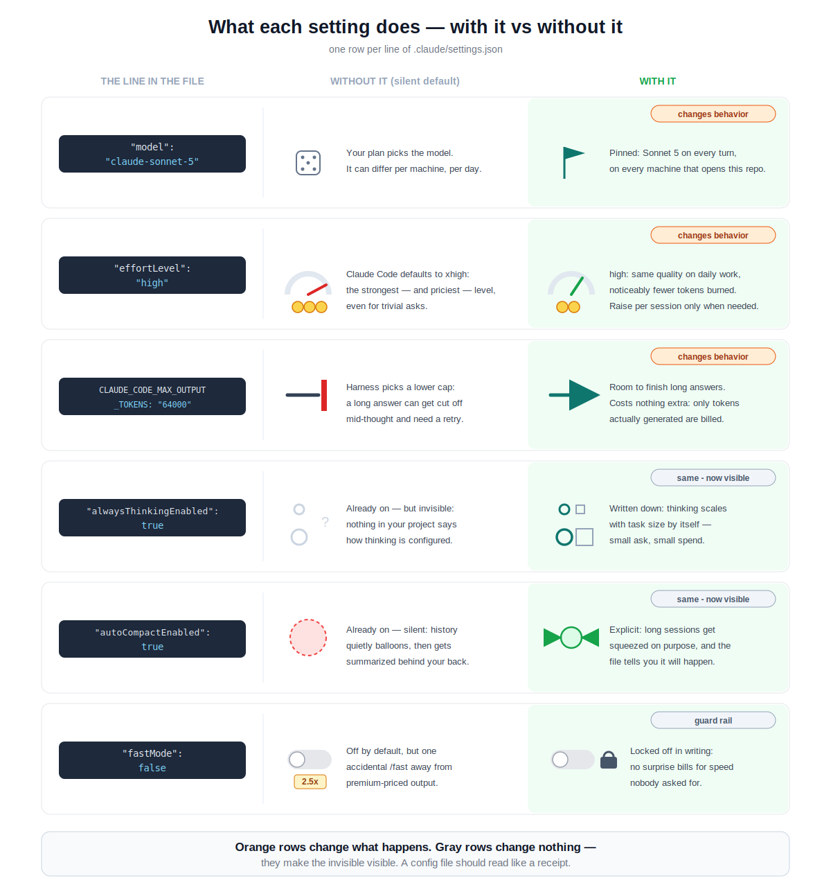

# Sonnet 5 vs Opus 4.8 vs Fable 5 — which one, when?

One picture:

## The ladder

1. **Start on Sonnet 5.** It handles most everyday coding and writing at the
   lowest price. This is what the model picker itself recommends as default.
2. **Climb to Opus 4.8 when Sonnet struggles** — complex designs, tricky
   debugging, careful reviews. Roughly 2x the cost.
3. **Climb to Fable 5 only for the top of the mountain** — problems Opus
   cannot solve, and all-night autonomous runs that must not drift. Roughly
   2x again.

Nine out of ten tasks never leave rung one. That is the whole point.

## How to close the gap — and why it works

Five tricks, each copying a habit the top rung has by default:

1. `thinking: adaptive` — think before acting; spend only when the task needs it.
2. `effort: xhigh` — buys more computing per answer; reaches everything below the ceiling.
3. Whole brief in the first message — drift starts where guessing starts.
4. "When X, do Y" rules — lower rungs can search / delegate / self-check, but wait to be asked.
5. Checkpoints on long jobs — errors snowball over hours; a check melts them while small.

The banner line is the whole theory: habits can be copied, brainpower cannot.

## Recommended settings

This repo ships [.claude/settings.json](.claude/settings.json) — Sonnet 5 as
the daily default, with every value written out explicitly, including the
ones that would otherwise be silent defaults.
**[.claude/README.md](.claude/README.md) maps each line to the exact API
request field it controls** — read that to see what actually happens on
every turn.

What each line does, with it vs without it:

Climbing the ladder needs no config change: `/model` switches the session
to Opus 4.8 or Fable 5 and back.

## Fine print

- Sticker prices per MTok: Sonnet 5 $3/$15 (intro $2/$10 through Aug 2026),
  Opus 4.8 $5/$25, Fable 5 $10/$50.
- Sonnet 5's tokenizer counts ~30% more tokens for the same text than older
  Sonnets — the total is still the cheapest of the three.
- They are different models, not different settings. Fable 5 is a tier above
  the Opus family; its thinking step cannot be turned off, and it is trained
  for long autonomous runs where tiny errors compound.
- Parameter counts and architecture are not public; everything here comes
  from the official API surface and pricing.

Official announcement:
https://www.anthropic.com/news/claude-fable-5-mythos-5
